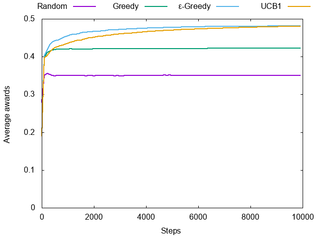

多椀バンディットのサンプルコード
===

[これからの強化学習](https://www.amazon.co.jp/dp/4627880316)の1.1節に出てくる多椀バンディット問題のRubyによるサンプル実装です。

# 使い方

    $ make

# 結果

* Random: ランダムに腕を選ぶ
* Greedy: 最初にn回ずつ試して、その中でもっとも報酬が良かったものを選ぶ
* ε-Greedy: これまでに最も報酬が良かった腕を選ぶが、確率εでランダム
* UCB1: Upper Confident Bound法で選ぶ

# ライセンス

MIT